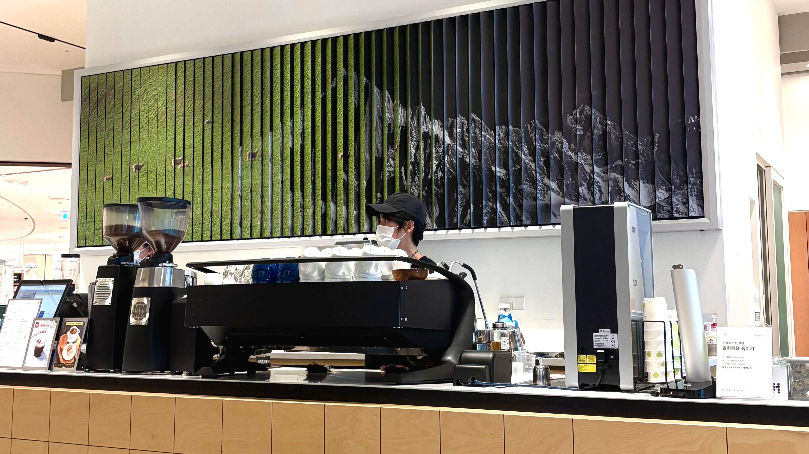
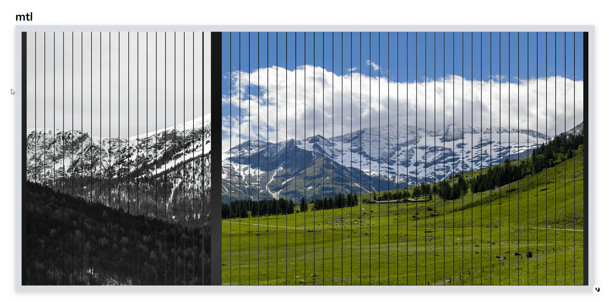

# mtl-banner

An automatic vertical-blind style image banner built with Framer Motion. A row of thin cards flips sequentially, split-flap-display style, to transition between images.

🔗 Demo: [mtl-banner.vercel.app](https://mtl-banner.vercel.app)

## How It Works

- 60 vertical cards spanning the screen (`CardStack`) each render a horizontal slice of a background image.
- Cards flip 180° one at a time in sequence (`FlipCard`) to reveal the next image; once the whole row has flipped, it waits for a delay (`SET_DELAY`) and then repeats from the start.
- Hovering over a card flips just that card back to the previous image.
- The banner only renders on desktop (`lg` breakpoint and up); on mobile, a placeholder screen (`Mobile`) tells the visitor to switch to desktop.

## Tech Stack

- React 19
- Vite
- Framer Motion (`motion`)
- Tailwind CSS 4

## Project Structure

```
mtl-banner/
├── public/
│   ├── CardFace1.png
│   ├── CardFace2.jpg
│   └── CardFace3.png        # Images shown in the banner
├── src/
│   ├── components/
│   │   ├── cards/
│   │   │   ├── CardStack.jsx    # Card layout and sequential flip timing
│   │   │   ├── FlipCard.jsx     # Per-card flip animation & hover behavior
│   │   │   ├── CardFace.jsx     # Slices the background image per card
│   │   │   └── cards.data.js    # Card count and image list
│   │   └── layout/
│   │       ├── Container.jsx    # Desktop layout
│   │       └── Mobile.jsx       # Mobile placeholder screen
│   ├── App.jsx
│   ├── main.jsx
│   └── globals.css
├── index.html
├── vite.config.js
└── package.json
```

## Getting Started

### Prerequisites

- Node.js (latest LTS recommended)

### Install & Run

```bash
cd mtl-banner
npm install
npm run dev
```

Open [http://localhost:5173](http://localhost:5173) to see the result.

### Scripts

| Command | Description |
| --- | --- |
| `npm run dev` | Start the development server |
| `npm run build` | Create a production build |
| `npm run preview` | Preview the production build |
| `npm run lint` | Run ESLint |

## Customization

- To change the images shown in the banner, add images to `public/` and update the `images` array in `src/components/cards/cards.data.js`.
- Adjust the card count via the `Array.from({ length: 60 }, ...)` value in `cards.data.js`.
- Flip speed and the pause between cycles can be tuned via `FLIP_DURATION` in `FlipCard.jsx` and `FLIP_SPEED` / `SET_DELAY` in `CardStack.jsx`.

## Deployment

Deploying via the [Vercel Platform](https://vercel.com/new) is recommended.

## How I built this - Tech Blog

Open [This Blog Post](https://riachoi-services.vercel.app/blog/cinematic-flip-card-interface-with-react-and-framer-motion) to see the detail.


